# Numerical simulation of an idealized stochastic atmosphere model
This repository contains code for the simulation of an [idealized stochastic atmosphere model](https://ediss.sub.uni-hamburg.de/handle/ediss/12005). 

## Stochastic atmosphere model
The governing equations for the atmosphere model are
```math
\begin{aligned}
        &\mathrm{d} \mathbf{u} + \left(\mathbf{u} \mathrm{d} t + \sum_i \boldsymbol{\xi}_i \circ \mathrm{d} W^i\right)\cdot \nabla \mathbf{u} + \frac{1}{Ro} \hat{\mathbf{z}} \times \mathbf{u}~\mathrm{d} t + \sum_i \left(\sum_{j=1}^2 u_j \nabla \xi_{i,j}\right)\circ \mathrm{d} W^i \\
        &\quad \quad = \left(-\frac{1}{C} \nabla \theta + \nu_e \Delta \mathbf{u}\right) \mathrm{d} t, \\
        &\mathrm{d} \theta + \nabla\cdot (\theta \mathbf{u}) \ \mathrm{d} t + \sum_i (\boldsymbol{\xi}_i \circ \mathrm{d} W^i) \cdot \nabla \theta = \eta_e \Delta \theta \ \mathrm{d} t.
\end{aligned}
```
These equations represent a stochastic extension of the deterministic two-dimensional model
```math
\begin{aligned}
        &\frac{\partial \mathbf{u}}{\partial t} + (\mathbf{u}\cdot \nabla)\mathbf{u} + \frac{\hat{\mathbf{z}} \times \mathbf{u}}{Ro} + \frac{\nabla \theta}{C} = \nu_e \Delta \mathbf{u}, \\
        &\frac{\partial \theta}{\partial t} + \nabla\cdot(\theta \mathbf{u}) = \eta_e \Delta \theta.
\end{aligned}
```
We solve the atmosphere model on a 2D domain with periodic boundary conditions applied in the zonal (East-West) direction. This configuration approximates mid-latitude atmospheric flow between $27.5^{\circ}$ and $62.5^{\circ}$ north latitude. Along the meridional (North–South) boundaries, we impose free-slip conditions on velocity:
```math
 u_2=0, \quad \frac{\partial u_1}{\partial y} = 0,
```
and insulated boundary conditions for temperature:
```math
\frac{\partial \theta}{\partial y} = 0.
```
Three different mesh configurations are considered for the numerical experiments (see table below). The idea is to run the deterministic model on the fine grid with size $1792 \times 256$ and use the high-resolution velocity data to calibrate the stochastic model which can later be run on coarser grids. 

| Parameter        | Fine grd           | Coarse grid 1  | Coarse grid 2|
| :------------- |:-------------:| :-----: |:-----: |
| Number of elements, $N_x \times N_y $     | $1792 \times 256$ | $448 \times 64$ | $224 \times 32$  | 
|Smallest element size, $\Delta x$|$1/256 \ (\sim 15 \ \text{km})$ | $1/64 \ (\sim 60 \ \text{km})$ | $1/32 \ (\sim 120 \ \text{km})$  
|Time-step size, $\Delta t$| $0.005 \ (\sim 4 \ \text{min.})$ | $0.02 \ (\sim 16 \ \text{min.})$ |$0.04 \ (\sim 32 \ \text{min.})$
|Eddy viscosity, $\nu_e $| $1/(3\times10^5)$ | $1/(3\times10^4)$ |$1/10^4$ 
|Diffusion coefficient, $\eta_e $| $1/(3\times10^5)$ | $1/(3\times10^4)$ |$1/10^4$ 
|Rossby number, $Ro$ | $0.3$ | $0.3$ | $0.3$
|$C$ | $0.02$ | $0.02$ | $0.02$ 

## This repository
This repository contains **python** scripts for solving the deterministic and stochastic atmosphere model equations. The scripts are designed to be run on **Firedrake** software. The folders `deterministic` and `stochastic` contain the code for deterministic and stochastic models, respectively.

Additionally, it contains **jupyter notebooks** ( in `deterministic/224x32/xi_calculation_visualization`) which we used to estimate the correlation vectors $\boldsymbol{\xi}_i$.

We used **numpy** and **matplotlib** libraries for further analyzing the simulation data and plotting results. **Jupyter notebooks** used for this purpose are also contained in this repository. 

## How to run the code?

The [Firedrake](https://www.firedrakeproject.org/) software needs to be installed for running the **Python** scripts in this repository. The scripts for the high resolution deterministic climate model are designed to be run on parallel cores. For example, if you want to run the model on 32 cores, simply execute (after activating the Firedrake environment) `mpiexec -n 32 python3 test1.py` in the terminal. 

The scripts for the stochastic model are designed to be run strictly on parallel cores. In this way, each core runs an independent realization of the stochastic partial differential equation (SPDE). 

## Simulation results
We show some of the main simulation results here. 
### Deterministic atmosphere model
<figure>
  
  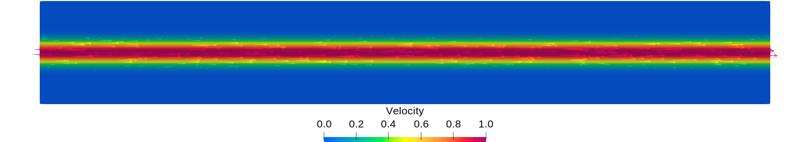
  
  <figcaption>Temperature (top), velocity (middle), and vorticity (bottom) fields at t = 0 from the deterministic model simulation on a 1792x256 grid.</figcaption>
</figure>
<p>&nbsp;</p>
<figure>
  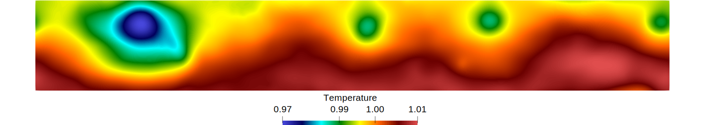
  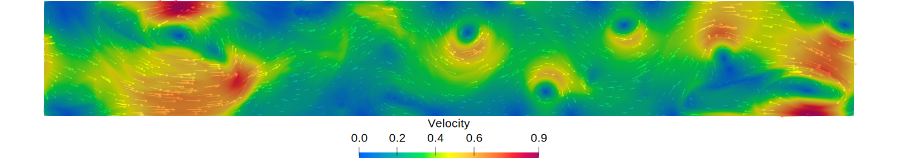
  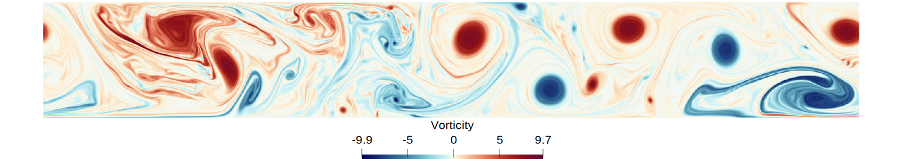
  <figcaption>Temperature (top), velocity (middle), and vorticity (bottom) fields at t = 27 from the deterministic model simulation on a 1792x256 grid.</figcaption>
</figure>
<p>&nbsp;</p>
<figure>
  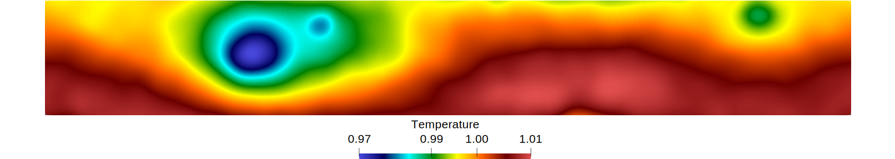
  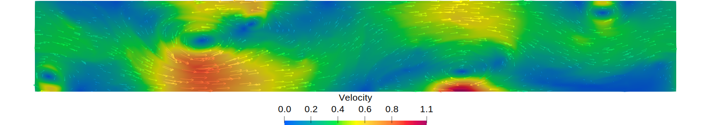
  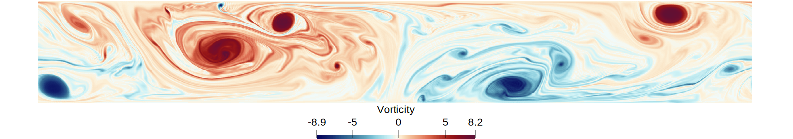
  <figcaption>Temperature (top), velocity (middle), and vorticity (bottom) fields at t = 45 from the deterministic model simulation on a 1792x256 grid.</figcaption>
</figure>

### Correlation vectors

Estimated $\boldsymbol{\xi}_i$ for the coarse grid of size $224 \times 32$. The $1{\text{st}}$ (top), $21{\text{st}}$ (middle), and $51{\text{st}}$ (bottom) $\boldsymbol{\xi}_i$ are shown. The first $51$ EOFs explain $90 \%$ of the total variance present in the observation data.
<figure>
  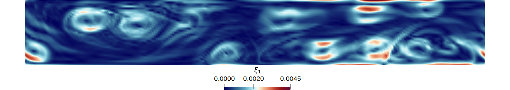
  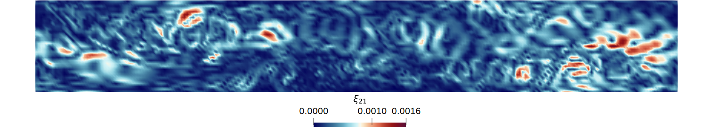
  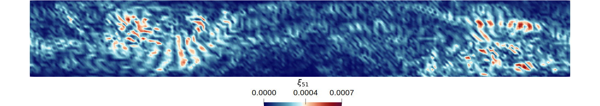
</figure>

### Stochastic model
<figure>
  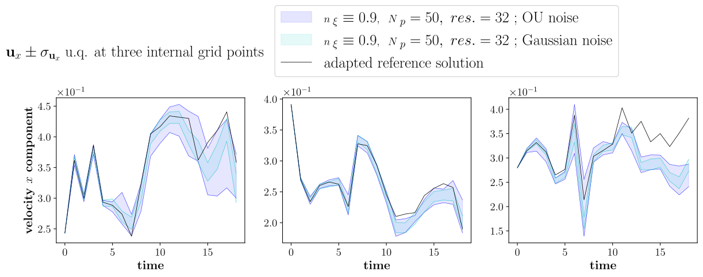
  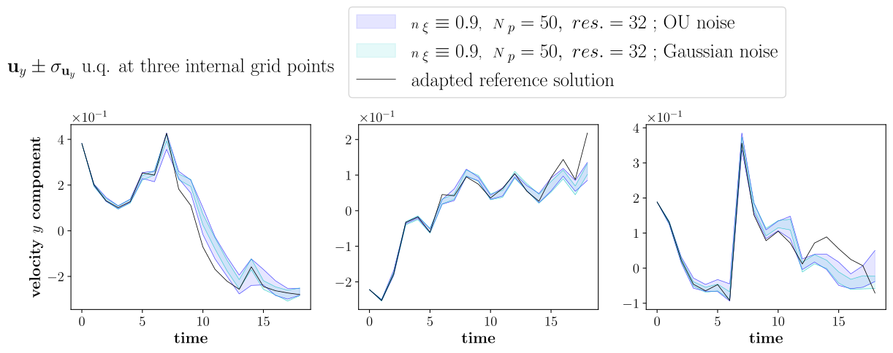
  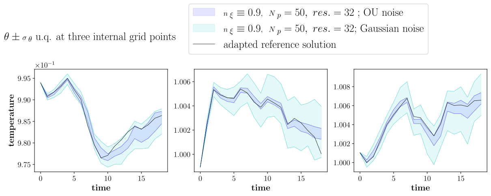
  <figcaption>Comparison of one standard deviation bands generated by the SPDE using Gaussian noise and the OU process for velocity (x and y components) and temperature. Results are compared to the adapted reference solution (black solid line) at three internal grid points. Colored regions indicate the ensemble spread.</figcaption>
</figure>

### Uncertainty quantification
<figure>
  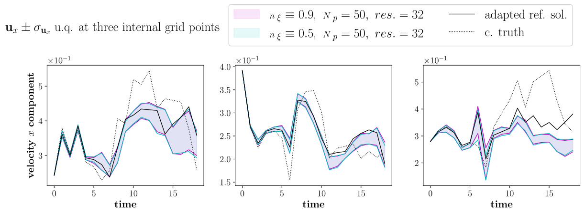
  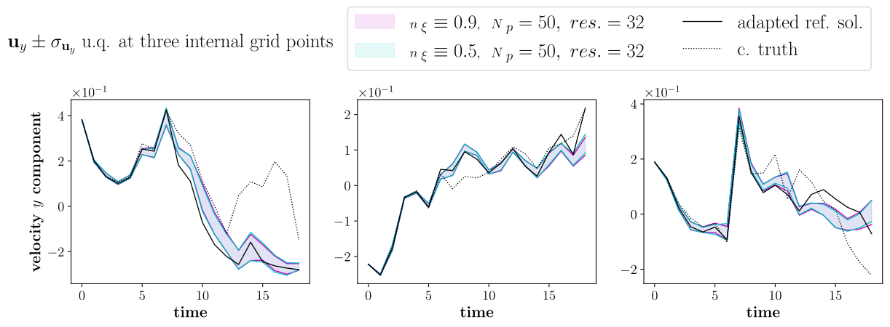
  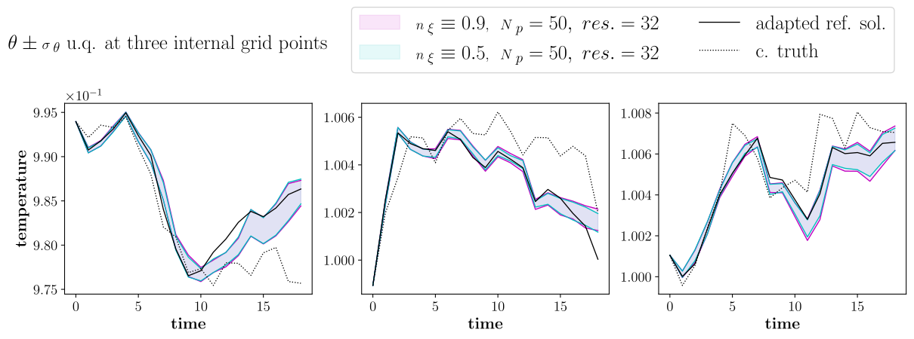
  <figcaption>Uncertainty quantification plots comparing one standard deviation bands about the ensemble mean with the truth and adapted reference solution at three internal grid points on the 224 x 32 grid. For a fixed ensemble size, spread sizes are shown for different numbers of EOFs.</figcaption>
</figure>